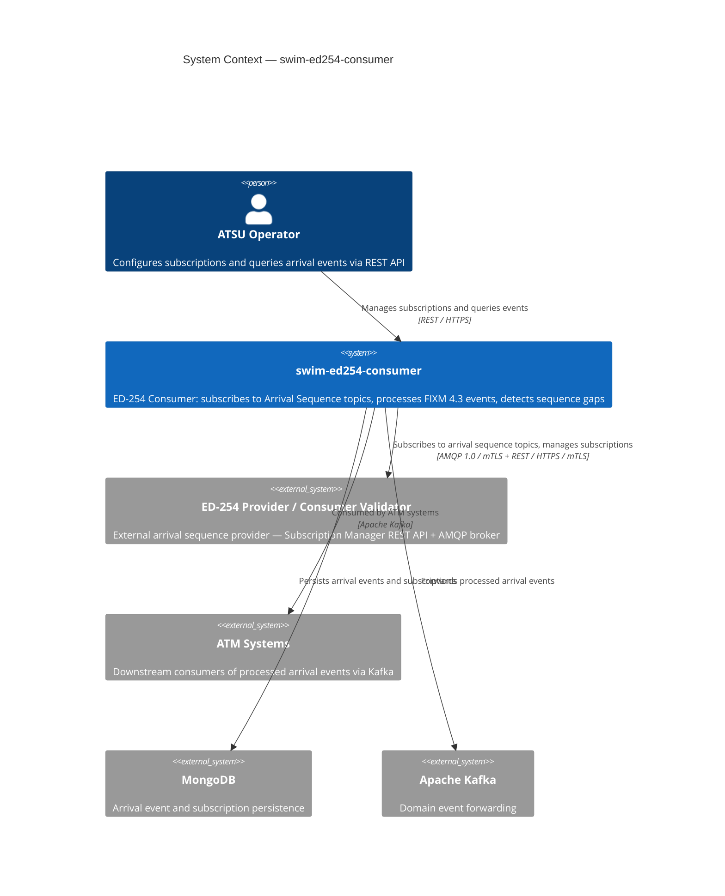
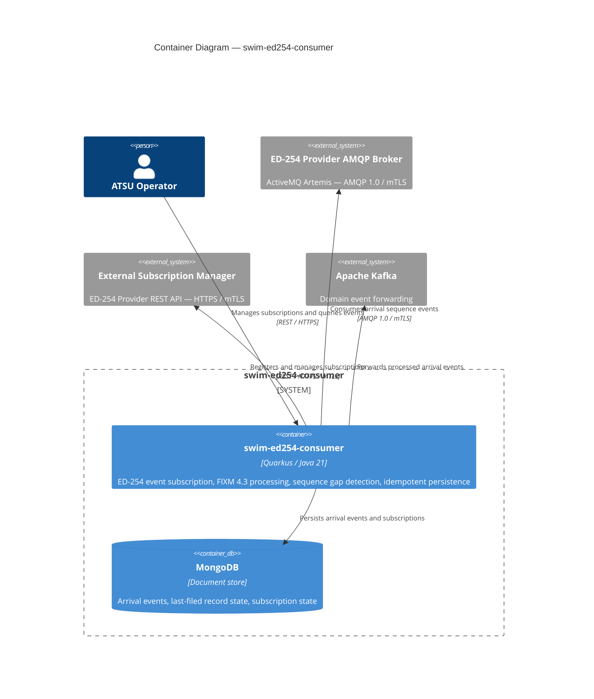
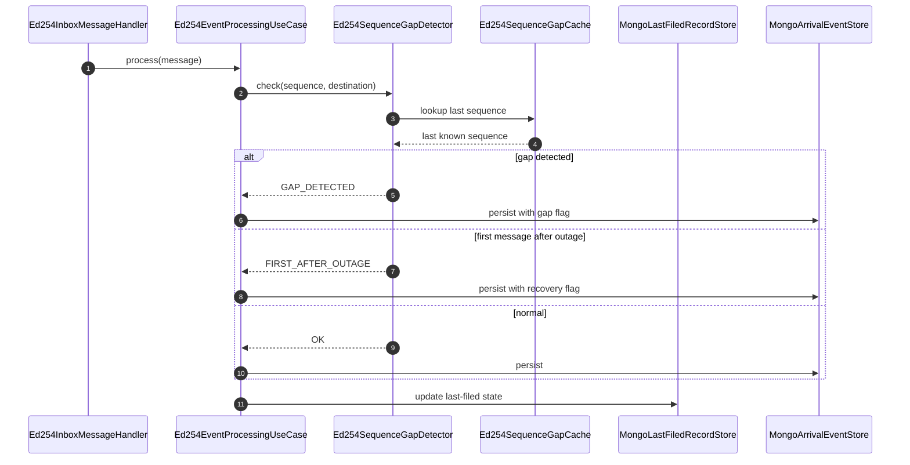

# swim-ed254-consumer — Architecture

> Diagrams use [Mermaid](https://mermaid.js.org) and render natively on GitHub.

**Role**: ATSU (Air Traffic Service Unit) consumer — subscribes to ED-254 Arrival Sequence events from an upstream provider, processes FIXM 4.3 XML payloads, detects sequence gaps, persists arrival events to MongoDB, and forwards them to Kafka.

---

## 1. System Context (C4 Level 1)

---

## 2. Container Diagram (C4 Level 2)

---

## 3. Component Diagram (C4 Level 3)

```mermaid
C4Component
    title Component Diagram — swim-ed254-consumer

    System_Ext(broker, "ED-254 Provider AMQP Broker")
    System_Ext(sm, "External Subscription Manager")
    System_Ext(mongo, "MongoDB")
    System_Ext(kafka, "Apache Kafka")

    Container_Boundary(consumer, "swim-ed254-consumer") {
        Component(subRes, "ConsumerSubscriptionResource", "JAX-RS / port/in", "REST endpoint — subscription CRUD")
        Component(evtRes, "ConsumerEventResource", "JAX-RS", "REST endpoint — arrival event queries")
        Component(opRes, "OperationalResource", "JAX-RS", "Operational metrics, event counts, DLQ queries")
        Component(ftRes, "FeatureResource", "JAX-RS", "WFS-style feature queries")

        Component(inboxHandler, "Ed254InboxMessageHandler", "SmallRye Messaging", "AMQP consumer — receives events, delegates to event processing use case")
        Component(outboxHandler, "Ed254OutboxMessageHandler", "Kafka Producer", "Routes processed arrival events to Kafka topics")

        Component(subUC, "Ed254SubscriptionUseCase", "CDI", "Subscription lifecycle: create, pause, resume, delete — via Subscription Manager")
        Component(evtUC, "Ed254EventProcessingUseCase", "CDI", "Orchestrates: parse FIXM XML, validate, gap-check, filter, persist, route to outbox")

        Component(filterSvc, "Ed254EventFilterService", "CDI", "Evaluates subscription filter criteria (destination aerodrome, flight selector)")
        Component(persistSvc, "Ed254EventPersistenceService", "CDI", "Persists arrival event via ArrivalEventStore port")
        Component(validator, "Ed254EventDataValidator", "CDI", "Validates FIXM event data against business rules")
        Component(gapDetector, "Ed254SequenceGapDetector", "CDI / Ed254SequenceGapPort SPI", "Detects sequence gaps and first message after outage using last-filed record state")
        Component(gapCache, "Ed254SequenceGapCache", "CDI / Ed254SequenceGapCachePort SPI", "In-memory cache for sequence gap detection state")

        Component(jaxbPool, "Ed254JaxbUnmarshallerPool", "JAXB", "Thread-safe pool of JAXB unmarshallers for FIXM 4.3 XML")
        Component(extractor, "Ed254EventExtractor", "CDI / SwimEventExtractor SPI", "Extracts event type and metadata from FIXM ED-254 message")

        Component(smAdapter, "Ed254SubscriptionManagerAdapter", "MicroProfile REST Client", "HTTP client to external Subscription Manager — implements RemoteSubscriptionManagerPort")
        Component(mongoArr, "MongoArrivalEventStore", "Panache / ArrivalEventStore port/out", "Arrival event persistence")
        Component(mongoLastFiled, "MongoLastFiledRecordStore", "Panache", "Last-filed arrival record state — used by gap detector")
        Component(mongoSub, "MongoSubscriptionStore", "Panache / SubscriptionStore port/out", "Subscription state persistence")
    }

    Rel(subRes, subUC, "calls via", "ManageSubscriptionPort")
    Rel(inboxHandler, evtUC, "delegates to")
    Rel(evtUC, jaxbPool, "unmarshals with")
    Rel(evtUC, extractor, "extracts metadata with")
    Rel(evtUC, validator, "validates with")
    Rel(evtUC, gapDetector, "gap-checks with")
    Rel(gapDetector, gapCache, "reads/updates")
    Rel(evtUC, filterSvc, "filters with")
    Rel(evtUC, persistSvc, "persists with")
    Rel(evtUC, outboxHandler, "routes to")
    Rel(subUC, smAdapter, "registers / updates via", "RemoteSubscriptionManagerPort")
    Rel(subUC, mongoSub, "persists via", "SubscriptionStore port")
    Rel(persistSvc, mongoArr, "persists via", "ArrivalEventStore port")
    Rel(persistSvc, mongoLastFiled, "updates last-filed state")

    Rel(inboxHandler, broker, "consumes", "AMQP 1.0 / mTLS")
    Rel(smAdapter, sm, "manages subscriptions", "REST / HTTPS / mTLS")
    Rel(mongoArr, mongo, "persists to")
    Rel(mongoLastFiled, mongo, "persists to")
    Rel(mongoSub, mongo, "persists to")
    Rel(outboxHandler, kafka, "publishes to")
```

---

## 4. Sequence Gap Detection

ED-254 requires consumers to detect gaps in the arrival sequence and respond accordingly. The `Ed254SequenceGapDetector` uses the `MongoLastFiledRecordStore` to track the last processed sequence number per destination aerodrome.

