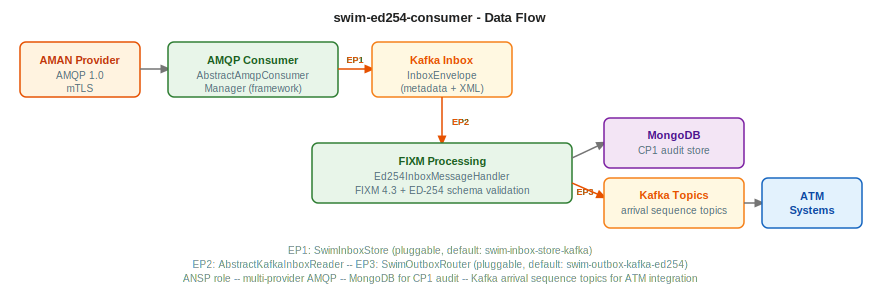

# swim-ed254-consumer

ANSP-role client for consuming ED-254 (Extended AMAN) Arrival Sequence Service events via SWIM infrastructure. Connects to one or more SWIM Subscription Managers, creates subscriptions, receives arrival sequence and provider exception events via AMQP 1.0 over TLS, validates against ED-254 XSD, persists to MongoDB, and distributes to Kafka topics.



## What it does

- **Configuration-driven subscriptions**, declares desired subscriptions as JSON, reconciles them automatically against the provider
- **Multi-provider support**, connects to multiple SWIM providers simultaneously, each with independent mTLS and AMQP configuration
- **AMQP 1.0 consumption**, receives ED-254 events with mTLS, backpressure control, and batch staging via Kafka inbox
- **XSD validation**, validates incoming FIXM-based arrival sequence messages against ED-254 schema
- **Sequence gap detection**, detects missing sequence numbers in arrival sequence streams
- **MongoDB persistence**, stores events and subscriptions with idempotency cache and dead letter queue
- **Kafka distribution**, routes events to topics by type (arrival sequences, provider exceptions)
- **Subscription renewal**, automatic renewal before expiration with configurable threshold
- **Heartbeat monitoring**, detects provider heartbeat loss per subscription
- **Outbox pattern**, reliable event delivery with recovery and cleanup schedulers
- **Observability**, OpenTelemetry tracing, Prometheus metrics, structured logging

---

## GET STARTED

### Prerequisites

- Java 21
- Maven 3.9+
- [Podman Desktop](https://podman-desktop.io), includes the Podman engine and a graphical interface for managing containers and compose stacks. Any OCI-compatible runtime with Compose support also works.
- [mkcert](https://github.com/FiloSottile/mkcert), local certificate authority

  **macOS**
  ```bash
  brew install mkcert
  ```

  **Fedora / RHEL**
  ```bash
  sudo dnf install nss-tools
  curl -Lo mkcert https://dl.filippo.io/mkcert/latest?for=linux/amd64
  chmod +x mkcert
  sudo mv mkcert /usr/local/bin/
  ```

  **Debian / Ubuntu**
  ```bash
  sudo apt install libnss3-tools
  curl -Lo mkcert https://dl.filippo.io/mkcert/latest?for=linux/amd64
  chmod +x mkcert
  sudo mv mkcert /usr/local/bin/
  ```

  **Linux (Homebrew)**
  ```bash
  brew install mkcert
  ```

  **Windows (Chocolatey)**
  ```powershell
  choco install mkcert
  choco install openssl
  ```

  **Windows (Scoop)**
  ```powershell
  scoop bucket add extras
  scoop install mkcert
  scoop install openssl
  ```

  > On Windows, `openssl` is also bundled with Git for Windows and is usually already on the PATH.

### 0. Generate local certificates

The consumer connects to the validator's Artemis broker via mTLS on port 5671 by default. Generate the certificates before starting the infrastructure.

**macOS / Linux**
```bash
./certs/generate.sh
```

**Windows (PowerShell)**
```powershell
.\certs\generate.ps1
```

This is a one-time step per machine. It uses `mkcert` to create a local CA (installed into your system trust store), then generates:

- `certs/broker.p12`: Artemis broker keystore, mounted into the validator container
- `certs/ca-truststore.p12`: CA truststore for Artemis, used to verify the consumer client cert
- `certs/keystore.jks`: consumer client keystore, used by the Quarkus dev profile
- `certs/truststore.jks`: consumer CA truststore, used by the Quarkus dev profile

The broker certificate covers `localhost`, `127.0.0.1`, `ed254-consumer-validator-artemis`, `artemis.127.0.0.1.nip.io`, and `ed254-consumer-validator-artemis.127.0.0.1.nip.io`. No `/etc/hosts` entries needed.

### 1. Start the local infrastructure

The `compose.yml` at the root of this project brings up everything the consumer needs: a fake SWIM provider (Subscription Manager API + AMQP broker + ED-254 event generator), MongoDB, and Kafka.

The Artemis broker is built from `src/local-dev/artemis/`. Use `--build` the first time, or after any change to those files:

```bash
podman compose up --build -d
```

On subsequent runs, when nothing in `src/local-dev/artemis/` has changed, the cached image is used:

```bash
podman compose up -d
```

> **Tip:** [Quarkus Dev Services](https://quarkus.io/guides/dev-services) can also provision databases and brokers automatically during `./mvnw quarkus:dev`, as an alternative to the `compose.yml`.

Services started:

| Service | Port | Description |
|---------|------|-------------|
| `ed254-consumer-validator` | 8085 | Mock Subscription Manager REST API + event generator |
| `ed254-consumer-validator-artemis` | 5671 (AMQPS/mTLS), 5672 (plain), 8165 | AMQP broker (fake provider side) |
| `ed254-consumer-validator-mariadb` | 3309 | Validator persistence |
| `ed254-consumer-mongodb` | 27018 | Consumer event store |
| `ed254-consumer-mongo-express` | 9082 | MongoDB web UI |
| `kafka` | 9092 | Kafka broker (KRaft) |
| `ed254-consumer-akhq` | 9083 | Kafka web UI (AKHQ) |

#### About the consumer validator

The `ed254-consumer-validator` simulates a real SWIM provider: it exposes the Subscription Manager REST API, manages an Artemis broker, and periodically publishes real ED-254 events. The consumer connects to it exactly as it would connect to a production provider.

The compose uses the pre-built image `quay.io/masales/swim-ed254-consumer-validator:latest`, pulled fresh on every `podman compose up`.

If you want to run the validator from source instead of the pre-built image, clone `swim-ed254-consumer-validator`, start its infrastructure separately, and run:

```bash
./mvnw quarkus:dev
```

Then update `src/main/resources/application-dev.properties` to point `swim.providers` at the locally running validator instead of the compose container.

### 2. Run the consumer

```bash
./mvnw quarkus:dev
```

Add `-Ddebug=false` to skip the remote debug port (5005) if you do not need a debugger attached:

```bash
./mvnw quarkus:dev -Ddebug=false
```

To make the REST API accessible from other machines on the same network (useful on headless servers or VMs), bind to all interfaces:

```bash
./mvnw quarkus:dev -Dquarkus.http.host=0.0.0.0 -Ddebug=false
```

The API will be reachable at `http://<your-ip>:8080`.

The `dev` profile connects to the infrastructure above. The consumer will subscribe to the validator, receive ED-254 events, persist them to MongoDB, and publish to Kafka.

| URL | Description |
|-----|-------------|
| http://localhost:8080 | REST API |
| http://localhost:8080/swagger-ui | Swagger UI |
| http://localhost:8080/q/health | Health |
| http://localhost:8165 | Artemis console (admin / admin) |
| http://localhost:9082 | MongoDB UI |
| http://localhost:9083 | Kafka UI (AKHQ) |

### 3. Verify, happy path

Wait ~30 seconds for the consumer to reconcile subscriptions with the validator. Then:

```bash
# Check overall health
curl -s http://localhost:8080/q/health | jq .status

# List subscriptions, at least one should be ACTIVE
curl -s http://localhost:8080/api/v1/subscriptions | jq '.[] | {id, status, topic}'

# Check received events (the validator publishes events automatically)
curl -s "http://localhost:8080/api/v1/events?size=5" | jq '.content[] | {messageId, aerodromeDesignator, messageType, receivedAt}'
```

The consumer is working correctly when:
- `GET /q/health/ready` returns `{"status":"UP"}`
- At least one subscription shows `"status":"ACTIVE"`
- Events appear in MongoDB (http://localhost:9082 → `swim_ed254` db → `ed254_arrival_events` collection)
- Events appear in Kafka topics (http://localhost:9083, AKHQ)

### mTLS in dev mode

The default dev profile connects to the validator's Artemis on port **5671** using mTLS. This matches production behaviour and is the recommended approach.

If you need to temporarily bypass mTLS (for example, to isolate a connectivity issue), edit `application-dev.properties` to switch to the plain AMQP port:

```properties
# switch provider amqpBroker port from 5671 to 5672 and set sslEnabled to false
swim.providers=[{"providerId":"validator","subscriptionManager":{"url":"http://localhost:8085","tls":null,...},"amqpBroker":{"host":"localhost","port":5672,"sslEnabled":false,"username":"admin","password":"admin","tls":null}}]
```

The plain AMQP port 5672 on the validator container is always available alongside 5671. Revert to mTLS once the issue is identified.

---

## Kafka topic distribution

| Topic | Content | Use case |
|-------|---------|----------|
| `ed254-inbox-topic` | Raw ED-254 events (staging) | Decoupled processing pipeline |
| `ed254-arrival-sequence-topic` | Arrival sequence snapshots | Real-time sequencing data for upstream controllers |
| `ed254-provider-exception-topic` | Provider exceptions | AMAN unavailability, degraded mode notifications |
| `ed254-dlq-topic` | Failed messages | Dead letter queue for investigation |

---

## REST API

| Method | Endpoint | Description |
|--------|----------|-------------|
| `GET` | `/api/v1/subscriptions` | List all subscriptions |
| `GET` | `/api/v1/subscriptions/active` | List active subscriptions |
| `POST` | `/api/v1/subscriptions` | Create manual subscription (`destinationAerodrome` required) |
| `PUT` | `/api/v1/subscriptions/{id}` | Update status (ACTIVE/PAUSED) |
| `DELETE` | `/api/v1/subscriptions/{id}` | Delete subscription |
| `GET` | `/api/v1/topics` | List configured topics (from `ed254.subscriptions`) |
| `GET` | `/api/v1/events` | List arrival events (`?aerodrome=LPPT`, `?page=0`, `?size=20`) |
| `GET` | `/api/v1/events/range` | Events by date range (`?startDate=`, `?endDate=`, `?aerodrome=`, pagination) |
| `GET` | `/api/v1/events/{messageId}` | Get event by AMQP message ID |
| `GET` | `/api/v1/events/count` | Count events (`?aerodrome=LPPT` optional) |
| `GET` | `/api/v1/features` | WFS GetFeature proxy to provider (WS-Light request/reply) |
| `GET` | `/api/v1/dlq` | Dead letter queue messages |
| `GET` | `/api/v1/dlq/count` | DLQ message count |
| `GET` | `/api/v1/stats` | Consumer statistics |

Swagger UI available at `/swagger-ui`.

---

## Environment variables

### Provider connection (`SWIM_PROVIDERS`)

The full provider configuration is a JSON array set via `SWIM_PROVIDERS`. Each entry configures one external SWIM provider.

```json
[
  {
    "providerId": "my-provider",
    "subscriptionManager": {
      "url": "https://sm.provider.example",
      "tls": {
        "trustStorePath": "/certs/truststore.jks",
        "trustStorePassword": "changeit",
        "keyStorePath": "/certs/keystore.jks",
        "keyStorePassword": "changeit"
      }
    },
    "amqpBroker": {
      "host": "amqp.provider.example",
      "port": 5671,
      "sslEnabled": true,
      "tls": {
        "trustStorePath": "/certs/truststore.jks",
        "trustStorePassword": "changeit",
        "keyStorePath": "/certs/keystore.jks",
        "keyStorePassword": "changeit"
      }
    }
  }
]
```

> **Always point to the consumer validator, never to the actual provider.** See `consumer-connects-to-validator` rule.

### Subscriptions (`ED254_SUBSCRIPTIONS`)

```json
[
  {
    "provider": "my-provider",
    "destinationAerodrome": [{"aerodromeDesignator": "LPPT"}],
    "supplementaryData": {
      "delay": true,
      "landingSequencePosition": true,
      "amanStrategy": false,
      "departureAerodrome": false,
      "proposedProcedure": false
    },
    "description": "Arrival sequences at Lisbon"
  }
]
```

### All variables

| Variable | Default | Description |
|----------|---------|-------------|
| `SWIM_PROVIDERS` | `[{...localhost...}]` | JSON array of SWIM provider configurations (SM URL + AMQP broker) |
| `ED254_SUBSCRIPTIONS` | see above | JSON array of desired subscriptions |
| `MONGODB_URI` | `mongodb://localhost:27017` | MongoDB connection string |
| `MONGODB_DATABASE` | `swim_ed254` | MongoDB database name |
| `KAFKA_BOOTSTRAP_SERVERS` | `kafka-kafka-bootstrap:9092` | Kafka bootstrap servers |
| `SWIM_VALIDATION_ENABLED` | `true` | Enable XSD validation against ED-254 schema |
| `ED254_MESSAGE_VALIDITY_THRESHOLD_MS` | `30000` | Max age (ms) before a message is considered stale |
| `SWIM_RENEWAL_ENABLED` | `true` | Enable automatic subscription renewal |
| `SWIM_RENEWAL_CHECK_INTERVAL` | `5m` | How often to check for expiring subscriptions |
| `SWIM_RENEWAL_THRESHOLD` | `1h` | Renew when less than this time remains |
| `RECONCILIATION_RETRY_INTERVAL` | `10s` | Retry interval for subscription reconciliation |
| `RECONCILIATION_RETRY_INITIAL_DELAY` | `30s` | Initial delay before first reconciliation attempt |
| `SWIM_SCHEDULER_INITIAL_DELAY` | `30s` | Startup delay before schedulers begin |
| `SWIM_OUTBOX_RECOVERY_INTERVAL` | `30s` | Outbox recovery sweep interval |
| `SWIM_OUTBOX_MAX_RETRIES` | `5` | Max retry attempts for outbox delivery |
| `SWIM_IDEMPOTENCY_CACHE_SIZE` | `50000` | Max entries in idempotency cache |
| `SWIM_IDEMPOTENCY_CACHE_TTL` | `PT2H` | Cache TTL for processed message IDs |
| `VERTX_WORKER_POOL_SIZE` | `100` | Vert.x worker thread pool size |
| `THREAD_POOL_MAX_THREADS` | `250` | Max application thread pool size |
| `OTEL_ENABLED` | `true` | Enable OpenTelemetry tracing |
| `OTEL_ENDPOINT` | `http://localhost:4317` | OTLP collector endpoint |
| `PROMETHEUS_ENABLED` | `true` | Enable Prometheus metrics at `/q/metrics` |

---

## Container images

Pre-built multi-arch images (linux/amd64 + linux/arm64):

```
quay.io/masales/swim-ed254-consumer:latest
```

Run with Podman (or any OCI runtime):

```bash
podman run -p 8080:8080 \
  -e MONGODB_URI=mongodb://host:27017 \
  -e KAFKA_BOOTSTRAP_SERVERS=kafka:9092 \
  -e SWIM_PROVIDERS='[{"providerId":"validator","subscriptionManager":{"url":"https://sm.provider.example"},"amqpBroker":{"host":"amqp.provider.example","port":5671,"sslEnabled":true}}]' \
  -e ED254_SUBSCRIPTIONS='[{"provider":"validator","destinationAerodrome":[{"aerodromeDesignator":"LPPT"}]}]' \
  quay.io/masales/swim-ed254-consumer:latest
```

---

## Build

### From source

```bash
./mvnw clean package -DskipTests
```

### Container images

```bash
make jvm                 # JVM multi-arch image, build + push  (fastest)

make native-amd64        # Native amd64, build + push  (run on amd64 machine)
make native-arm64        # Native arm64, build + push  (run on arm64 machine)
make manifest            # Create multi-arch manifest from registry images
make push                # Push manifest to registry
```

Override registry or tag: `make jvm REGISTRY=quay.io/myorg TAG=v1.2.3`

Run `make deps` to see which sibling repos to install first.

---

## Health checks

| Endpoint | Description |
|----------|-------------|
| `/q/health/live` | Liveness probe |
| `/q/health/ready` | Readiness probe |
| `/q/health` | Combined status |

---

## Deployment

Helm chart in `src/main/helm/` with CRC and production values.

For operator-based deployment (single CR), see [swim-operator](https://github.com/swim-developer/swim-operator).

---

## Related projects

| Project | Why you need it |
|---------|----------------|
| [swim-ed254-consumer-validator](https://github.com/swim-developer/swim-developer-validators) | Fake SWIM provider for local testing: included in `compose.yml` |
| [swim-developer-extensions](https://github.com/swim-developer/swim-developer-extensions) | Kafka outbox routers for ED-254 events |
| [swim-fixm-model-ed254](https://github.com/swim-developer/swim-fixm-model-ed254) | FIXM 4.3 + ED-254 JAXB bindings used internally |
| [swim-developer-framework](https://github.com/swim-developer/swim-developer-framework) | Core framework this service is built on |
| [swim-developer-tools](https://github.com/swim-developer/swim-developer-tools) | Certificate generation, full-stack compose, pipelines |

---

## License

Licensed under the [Apache License 2.0](LICENSE).
